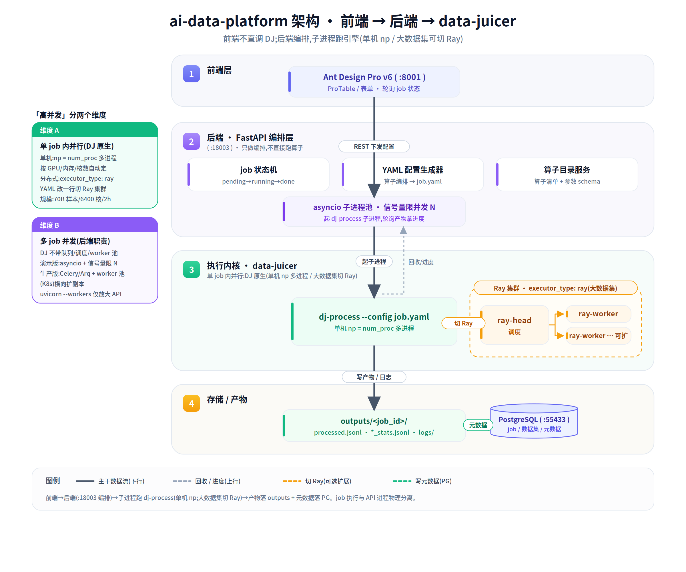

# data-juicer 集成方式与高并发部署调研

> 调研日期:2026-06-08。证据基于 data-juicer 1.5.2 源码 + 官方文档实读(非推断)。
> 解决两个问题:① 前端如何调用 data-juicer ② DJ 是否支持高并发/多 worker 部署。

---

## 0. 结论速览(TL;DR)

1. **前端不直接调 DJ**,走三层:`前端(:8001) → 后端 FastAPI(:18003) → data-juicer`。后端是编排者。
2. 后端接 DJ 的最优方式是 **子进程 `dj-process --config <yaml>`**(进程隔离、规避 Py3.11/3.12 版本冲突、今天已实测、并发好控)。DJ 自带的 HTTP 服务是"算子级 RPC",不是 job 管理器;Python 内嵌因版本/依赖/多进程问题不推荐。
3. DJ 的"高并发"要分两层:
   - **单 job 内并行**:DJ 原生支持。单机 `np`(num_proc 多进程,可自动调)+ 分布式 `executor_type: ray`(Ray 集群,论文级规模)。
   - **多 job 并发**:DJ **不自带**任务队列/worker 池,由**你的后端**负责(信号量 / Celery / K8s Job)。
4. `uvicorn --workers` 只放大 API 吞吐,**不能**在 API 进程里跑 DJ job。job 执行必须与 API 分离。

---

## 最终架构图



> 源文件:[`02-architecture.svg`](02-architecture.svg)(可编辑矢量)/ `02-architecture.png`(2x 位图,可直接贴 PPT)。
> 四层:① 前端(只发 REST/轮询)→ ② 后端 FastAPI 编排层(job 状态机 / YAML 生成 / 算子目录 / 子进程池,**不跑算子**)→ ③ 执行内核 data-juicer(子进程 `dj-process`,单机 np;大数据集切 Ray 集群)→ ④ 存储(PG 元数据 + outputs 产物)。

---

## 1. 前端如何调用 data-juicer

### 1.1 架构(与现有 datasources 调用同构)
```
浏览器前端 :8001            后端 FastAPI :18003                 data-juicer
┌──────────────┐  REST   ┌────────────────────────┐  子进程  ┌──────────────┐
│ ProTable/表单 │ ──────► │ /api/v1/processing-jobs │ ──────► │ dj-process    │
│              │ ◄────── │  job 状态机 + PG + 产物  │ ◄────── │  (执行内核)   │
└──────────────┘  轮询    └────────────────────────┘  产物/日志└──────────────┘
```
前端只发 REST(如 `POST /api/v1/processing-jobs`、轮询 `GET .../{id}`),**编排逻辑全在后端**。这与当前 `ingest-tasks` 页面的轮询模式一致,前端范式可直接复用。

### 1.2 后端 → DJ 的三种集成方式对比

| 维度 | ① 子进程 CLI ✅推荐 | ② DJ HTTP 服务 | ③ Python 内嵌 |
|------|------|------|------|
| 接法 | `dj-process --config x.yaml` | `uvicorn service:app`(:8000) | `import DefaultExecutor` |
| 隔离 | ✅ 进程级,崩溃不波及后端 | ✅ 独立服务 | ❌ 同进程,崩溃即挂 |
| Py 版本冲突 | ✅ 规避(DJ 3.11 / 后端 3.12) | ✅ 规避 | ❌ 直接冲突 |
| job 概念 | 自己建(正合需求) | ❌ 无,仅算子 RPC | 自己建 |
| 并发控制 | ✅ 后端起 N 个子进程,信号量限流 | 同步阻塞,需自己排队 | ❌ 多进程与异步 worker 打架 |
| 切 Ray | 只改 YAML 一行 `executor_type: ray` | 同 | 同 |
| 成本 | 进程启动 ~秒级;IPC 走文件 | 多维护一个常驻服务 | 最低延迟但坑最多 |

**选 ①**:今天已实测 `dj-process` 退出码 0、产出 `*.jsonl` + `*_stats.jsonl`,正好对应 plan 的 D1~D3。

### 1.3 DJ 的全部调用面(入口清单)
来自 `pyproject.toml [project.scripts]`:
- `dj-process`(`tools.process_data:main`)— 跑处理流水线(**主入口**)
- `dj-analyze`(`tools.analyze_data:main`)— 质量分析,出报告
- `dj-install`(`tools.dj_install:main`)— 按 config 装算子依赖
- `dj-mcp`(`tools.mcp_server:main`)— MCP server
- **HTTP 服务**:`service.py`(无独立 entrypoint,用 `uvicorn service:app` 启,adp 仓库 `/dj-api` 命令封装,:8000)

> ⚠️ 启 HTTP 服务的坑(来自 `/dj-api` 命令):uvicorn/fastapi 是 DJ 的 lazy 依赖、不在 venv 里,必须 `uv run --with uvicorn --with fastapi python -m uvicorn service:app --port 8000`,否则 `ModuleNotFoundError: loguru`。

### 1.4 DJ HTTP 服务到底是什么(为什么不当主路径)
读 `service.py` + `docs/DJ_service.md`:
- 它**自动扫描 `data_juicer` 包**,把公开方法注册成约 1000 个端点:**函数→GET,类方法→POST**(如 `POST /data_juicer/ops/filter/TextLengthFilter/compute_stats_batched`)。
- 调用是**同步阻塞**(`result = callable(**d_params)`,`service.py:127`),**无鉴权、无任务队列、无后台执行**。
- `cfg` 参数传 JSON、`dataset` 传服务器路径由服务端加载、`skip_return=True` 可免回传(`service.py:144-167`)。
- 定位:**算子级 RPC / 环境隔离**,方便"不深入框架就调单个算子"。**不是 job 管理器**——多算子流水线编排、job 生命周期、并发仍要你后端兜。

---

## 2. 高并发 / 多 worker 部署能力

### ⚠️ 必须分清两个维度
- **维度 A — 单 job 内部并行**:一条流水线跑得多快/多大。DJ 原生强项。
- **维度 B — 多 job 并发**:同时跑很多条流水线。DJ **不**负责,你后端负责。

### 2.1 维度 A:单 job 内并行(DJ 原生)

**单机多进程**
- 配置 `np`(默认 4,`config.py:315`):`--np` → 每个算子的 `num_proc`(`config.py:1106`)→ HuggingFace `datasets.map(num_proc=...)` 多进程。
- **自动并发度**:`process_utils.py:113-131` 按 GPU 数 / 可用内存 / CPU 核 取 `min` 自动定 num_proc(今天日志 "Set the auto num_proc to 10" 即此)。

**分布式(Ray)**
- 切换:YAML 里 `executor_type: ray` + `ray_address: 'auto'`(`docs/Distributed.md`)。
- 执行器:`ExecutorFactory`(`core/executor/factory.py`)支持 `default`/`ray`/`ray_partitioned`;Ray 实现在 `ray_executor.py` / `ray_executor_partitioned.py`。
- 装依赖:`uv pip install -e ".[dist]"`(含 Ray)。
- 起集群:`ray start --head` → 其他节点 `ray start --address='{head_ip}:6379'`。
- 集群拓扑(`.github/workflows/docker/docker-compose.yml`):`ray-head`(`ray start --head --dashboard-host 0.0.0.0`)+ `ray-worker`(`ray start --address=ray-head:6379`),同镜像,`shm_size: 256G`——标准 head+worker,worker 可水平扩 replicas。
- 规模实测(官方,`docs/Distributed.md`):70B 样本 / 6400 核 / 2h;TB 级 MinHash 去重 / 1280 核 / 3h。分布式专用去重算子 `ray_bts_minhash_deduplicator` 等。
- 几乎所有单机算子可无缝切 Ray(去重类例外,用 `ray_xx_deduplicator`)。

### 2.2 维度 B:多 job 并发(你后端的责任)
DJ **没有**内置 job 队列 / 调度器 / worker 池;HTTP 服务是单应用同步。所以:
- **演示版**:后端 `asyncio.create_subprocess_exec("dj-process", "--config", yaml)` + **信号量限并发**(如最多同时 2~4 个),job 状态/进度写 PG。
- **生产版**:任务队列(Celery / Arq / RQ)+ 独立 worker 进程池,或 K8s Job;每个 worker 跑一个 dj-process;重活(大数据集)路由到 Ray 集群。

### 2.3 `uvicorn --workers` 的真相
- `--workers N` 起 N 个 API 进程,**只放大 HTTP I/O 吞吐**。
- **绝不能**在 API worker 里直接跑 dj-process / DJ 算子:CPU 密集 + 内部多进程会阻塞事件循环、和 worker 的多进程模型打架。
- 正确分层:**API 服务(uvicorn 可多 worker)** 与 **job 执行(子进程/队列 worker)** 物理分离。

---

## 3. 给本项目的推荐架构

### 3.1 演示版(6/30,单机)
```
前端 :8001 ─REST─► 后端 :18003 ─┬─► PG(job 状态/产物元数据)
                                 └─► asyncio 子进程池(信号量限 N)
                                       └─► dj-process --config job.yaml  (np=单机多进程)
                                             └─► outputs/<job_id>/{processed.jsonl, *_stats.jsonl, logs/}
```
- 后端新增 `engine` 服务:YAML 生成 → 起子进程 → 轮询产物目录 + 解析日志拿进度 → 状态机入 PG。
- 并发:信号量(如 `asyncio.Semaphore(3)`),避免单机被打爆。
- 这正是 plan 的 D1~D3 + D4/D5。

### 3.2 生产版(规模化,演进方向)
```
前端 ─► 后端 API(uvicorn 多 worker,只做编排/不跑 job)
          └─► 任务队列(Celery/Arq)
                └─► worker 池(K8s Deployment,可扩副本)
                      ├─ 普通数据:dj-process(单机 np)
                      └─ 大数据集:dj-process(executor_type: ray)─► Ray 集群(head+worker，可扩)
```
- API 与 worker 分离;worker 横向扩副本 = 多 job 并发能力。
- 单条大 job 的算力 = Ray 集群规模。

---

## 4. 关键证据索引
| 主题 | 文件 |
|------|------|
| 入口脚本 | `data-juicer/pyproject.toml:176-180` |
| HTTP 服务实现 | `data-juicer/service.py`(同步 `_invoke`@127;自动注册@38-112) |
| HTTP 服务文档 | `data-juicer/docs/DJ_service.md` |
| `np`→num_proc | `config/config.py:315, 1106` |
| 自动并发度 | `utils/process_utils.py:113-131` |
| 执行器工厂 | `core/executor/factory.py`(default/ray/ray_partitioned) |
| Ray 执行器 | `core/executor/ray_executor.py`, `ray_executor_partitioned.py` |
| 分布式文档 | `docs/Distributed.md` / `docs/Distributed_ZH.md` |
| Ray 集群拓扑 | `.github/workflows/docker/docker-compose.yml`(ray-head + ray-worker) |
| Ray demo 配置 | `demos/process_on_ray/configs/{demo,dedup}.yaml` |
| adp 启 HTTP 服务 | `ai-data-platform/.claude/commands/dj-api.md`(:8000) |
