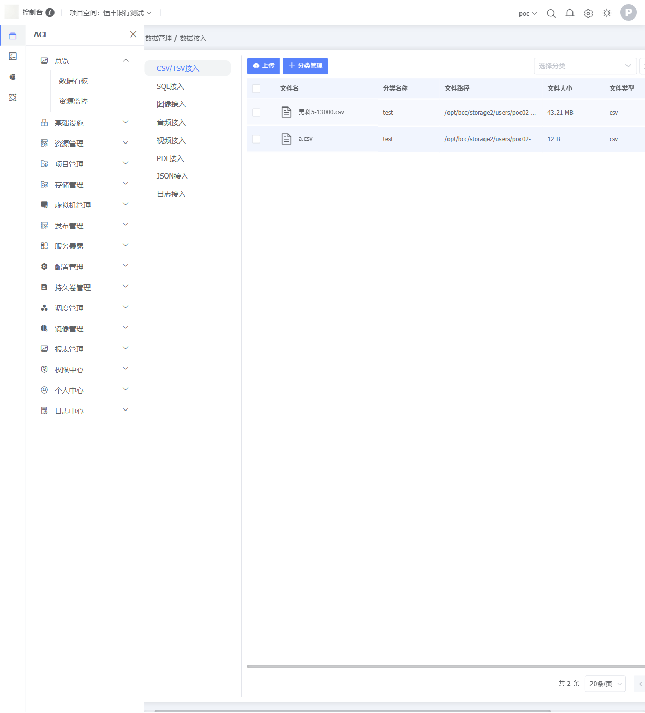
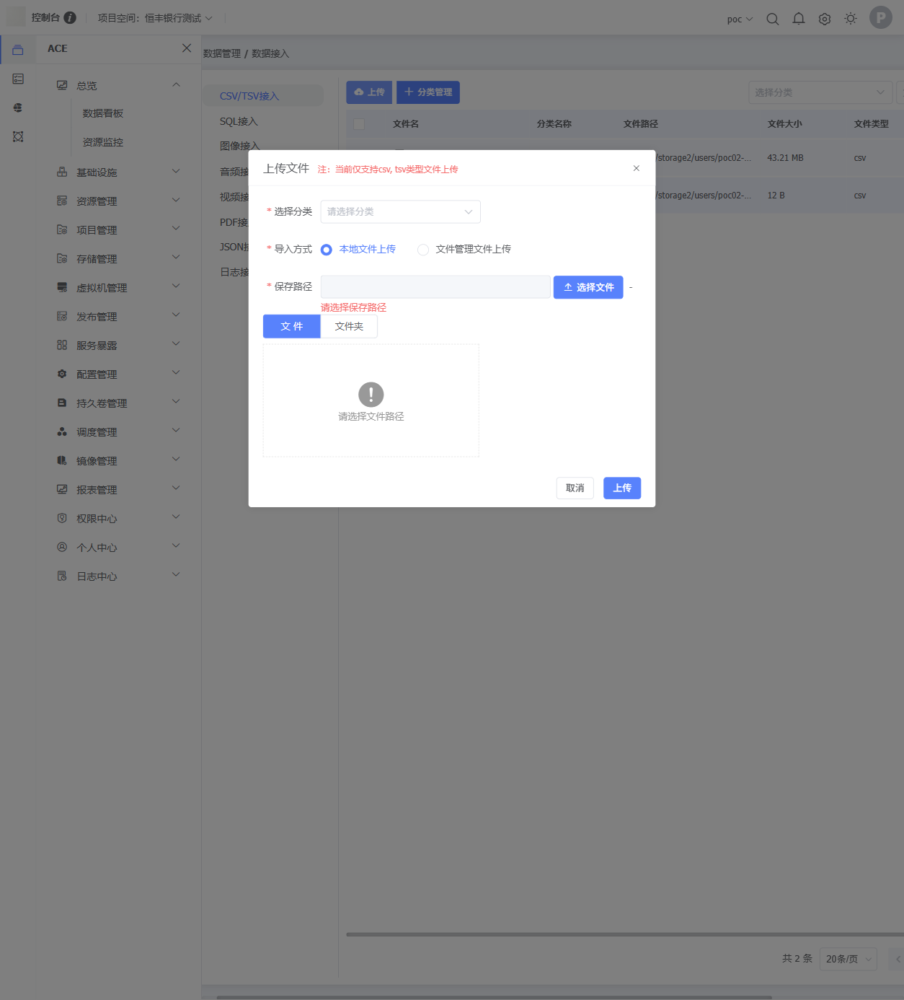
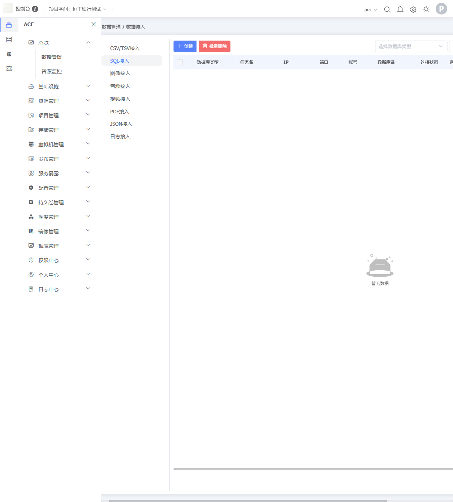

# BCC 平台「数据接入」功能调研

> 调研日期：2026-06-11  
> 调研人：Simple  
> 平台：模型训推平台（BCC PaaS）

---

## 一、访问信息

| 项目 | 值 |
|------|-----|
| 门户地址 | http://js1.blockelite.cn:25582/#/ |
| 数据接入页 | http://js1.blockelite.cn:25582/bcc/#/data/file/dataAccess |
| 账号 / 密码 | `poc02` / `Bocloud@2026` |
| 环境说明 | POC 演示环境，非生产 |

---

## 二、平台与菜单结构

平台正式名称为**模型训推平台（BCC PaaS）**，采用微前端架构（`layoutMicro` + `bccMicro` 两套 JS chunk），BCC 数据模块通过 hash 路由（`/bcc/#/data/...`）嵌入，与 ACE 基础设施模块（`/bcc/#/overview/...`）共享顶部导航，左侧 icon 切换模块。

「数据管理」一级菜单下有五个二级页面：

```
数据管理
├── 数据接入（/data/file/dataAccess）  ← 本文重点
│   ├── CSV/TSV接入
│   ├── SQL接入
│   ├── 图像接入
│   ├── 音频接入
│   ├── 视频接入
│   ├── PDF接入
│   ├── JSON接入
│   └── 日志接入
├── 文件管理（/data/file/user）
│   ├── 用户目录
│   ├── 项目目录
│   └── 共享目录
├── 数据集（/data/dataset/user）
│   ├── 用户数据集
│   ├── 项目数据集
│   └── 公共数据集
├── 数据标注（/data/labeling/user）
│   ├── 我创建的
│   └── 我参与的
└── 数据处理（/data/processing/list）
```

> 注意：数据接入页面的「左侧树」是页面内组件，而非路由级菜单，切换数据源类型不触发路由跳转。

---

## 三、数据接入页面布局

页面（`/bcc/#/data/file/dataAccess`）采用**两栏布局**：

- **左侧**：数据源类型树，共 8 个节点，按文件/协议类型分类；默认选中 CSV/TSV 接入。
- **右侧**：对应类型的文件/连接列表区，包含：
  - 工具栏（上传或创建按钮、分类管理按钮）
  - 筛选栏（分类下拉、文件名搜索框 + 搜索按钮）
  - 数据表格 + 底部分页

页面整体用于对不同类型结构化/非结构化数据进行统一的接入管理，通过「分类」机制对文件进行组织。



---

## 四、各功能点详述

### 4.1 CSV/TSV 接入

#### 文件列表（默认视图）

| 列名 | 说明 |
|------|------|
| 分类名称 | 文件所属分类 |
| 文件路径 | 存储路径 |
| 文件大小 | 单位字节/KB/MB |
| 文件类型 | csv / tsv |
| 创建人 | 上传者账号 |
| 创建时间 | 上传时间戳 |
| 操作 | 3 个图标按钮（推测：下载 / 预览 / 删除） |

工具栏：「上传」按钮、「分类管理」按钮、分类下拉筛选、文件名搜索框。  
底部分页默认每页 20 条，支持 10/20/30/40/50/100 切换。

#### 上传对话框

对话框标题：**上传文件**  
注释提示：*当前仅支持 csv, tsv 类型文件上传*

| 字段 | 类型 | 必填 | 说明 |
|------|------|:----:|------|
| 选择分类 | 下拉单选 | 是 | 枚举已创建分类（如「test」） |
| 导入方式 | 单选 | 是 | 「本地文件上传」或「文件管理文件上传」 |
| 保存路径 | 路径选择器 | 是 | 配合文件/文件夹切换按钮 |
| 选择文件 | 文件区（本地模式）/ 文件来源（文件管理模式） | 是 | 本地模式支持「文件」/「文件夹」切换，可批量上传整个目录 |

底部按钮：取消、**上传**。



#### 分类管理对话框

对话框标题：**分类管理**

| 列名 | 说明 |
|------|------|
| 序号 | 自增 |
| 分类名称 | 分类标识 |
| 分类备注 | 可选描述 |
| 创建人 | 操作账号 |
| 创建时间 | 创建时间戳 |
| 操作 | 编辑 / 删除 |

支持批量删除；内嵌「新增分类」按钮，弹出子对话框：

| 字段 | 类型 | 必填 | 限制 |
|------|------|:----:|------|
| 分类名称 | 文本 | 是 | 最多 50 字 |
| 分类备注 | 文本 | 否 | 最多 200 字 |

---

### 4.2 SQL 接入

SQL 接入是 8 种数据源中**唯一的数据库连接型**（非文件上传型），使用独立的「连接管理」范式。

#### 连接列表

工具栏：「创建」按钮、「批量删除」按钮。  
顶部筛选 Tab：`MySQL` / `PostgreSQL`（按数据库类型过滤）。

| 列名 | 说明 |
|------|------|
| 数据库类型 | MySQL / PostgreSQL |
| 任务名 | 连接名称 |
| IP | 数据库主机地址 |
| 端口 | 数据库端口 |
| 账号 | 数据库用户 |
| 数据库名 | 目标库名 |
| 连接状态 | 连接可用性状态（具体枚举值未实测确认） |
| 创建人 | 操作账号 |
| 创建时间 | 创建时间戳 |
| 操作 | 操作按钮组 |

#### 创建连接对话框

对话框标题：**创建连接**  
所有字段均为必填。

| 字段 | 类型 | Placeholder |
|------|------|------------|
| 连接名称 | 文本 | 请输入连接名称 |
| 数据库类型 | 下拉 | MySQL / PostgreSQL |
| IP | 文本 | 请输入IP地址 |
| 端口号 | 文本 | 请输入端口号 |
| 账号 | 文本 | 请输入账号 |
| 密码 | password | 请输入密码 |
| 数据库名 | 文本 | 请输入数据库名 |

底部按钮：取消、**测试连接**、**保存**（测试连接与保存分离，可先验证再提交）。



---

### 4.3 图像接入

注释提示：*当前仅支持 png, jpg, jpeg, gif, bmp, webp 类型文件上传*  
上传对话框字段、交互逻辑与 CSV/TSV 完全相同（分类 + 导入方式 + 保存路径 + 文件/文件夹切换）。  
文件列表表格列与 CSV/TSV 相同。

---

### 4.4 音频接入

注释提示：*当前仅支持 ogg, mp3, wav 类型文件上传*  
其余字段、交互与 CSV/TSV 接入相同。

---

### 4.5 视频接入

注释提示：*当前仅支持 mp4, mkv, webm 视频类型文件上传*  
其余字段、交互与 CSV/TSV 接入相同。

---

### 4.6 PDF 接入

注释提示：*当前仅支持 pdf 类型文件上传*  
其余字段、交互与 CSV/TSV 接入相同。

---

### 4.7 JSON 接入

注释提示：*当前仅支持 json 类型文件上传*  
其余字段、交互与 CSV/TSV 接入相同。

---

### 4.8 日志接入

注释提示：*当前仅支持 txt, xml, log, json 类型文件上传*  
其余字段、交互与 CSV/TSV 接入相同。  
注：json 格式在「日志接入」和「JSON 接入」中均支持，存在入口重叠。

---

## 五、支持的数据源与文件格式清单

| 数据源类型 | 支持格式 | 接入模式 |
|------------|---------|---------|
| CSV/TSV 接入 | csv, tsv | 文件上传 |
| SQL 接入 | — | 数据库连接（MySQL / PostgreSQL） |
| 图像接入 | png, jpg, jpeg, gif, bmp, webp | 文件上传 |
| 音频接入 | ogg, mp3, wav | 文件上传 |
| 视频接入 | mp4, mkv, webm | 文件上传 |
| PDF 接入 | pdf | 文件上传 |
| JSON 接入 | json | 文件上传 |
| 日志接入 | txt, xml, log, json | 文件上传 |

合计支持文件扩展名：csv · tsv · png · jpg · jpeg · gif · bmp · webp · ogg · mp3 · wav · mp4 · mkv · webm · pdf · json · txt · xml · log（19 种，json 重复计一次），外加 MySQL / PostgreSQL 两种数据库连接。

---

## 六、兄弟页面概览

### 文件管理（/data/file/user）

三页签：用户目录 / 项目目录 / 共享目录。提供类文件系统视图，支持上传、新建文件夹、列表/图标两种显示模式切换。每个文件/目录支持删除/复制/移动/压缩操作。

表格列：文件名、路径、大小、权限、密级、创建人、修改时间。

### 数据集（/data/dataset/user）

三页签：用户数据集 / 项目数据集 / 公共数据集。支持创建数据集、标注、发布、分享、下载、修改、删除，有模糊/精确两种查询模式。

表格列：名称、数据类型、大小、版本名称、创建时间、创建人、权限。

### 数据标注（/data/labeling/user）

两页签：我创建的 / 我参与的。展示标注任务列表。

表格列：任务名称、所属集群、标注数据集、标注场景、标注进度、标注状态、审核状态、创建时间。  
操作：启动、数据标注、结果下载、自动标注、标签管理、修改、删除。

### 数据处理（/data/processing/list）

单页面，展示数据处理任务列表。顶部状态筛选 Tab：未开始 / 排队中 / 运行中 / 已完成 / 终止 / 异常。

表格列：任务名称、数据处理类型、状态、描述、创建人、创建/开始/结束时间。支持新增任务。

---

## 七、限制与意外发现

1. **旧 session 残留弹窗**：登录后页面弹出「您已退出登录，请重新从门户网站登录」的 alert，但实际登录成功、正常进入 BCC 数据页面。该弹窗属于旧 session 残留提示，不影响使用。

2. **微前端架构**：平台为微前端架构（`layoutMicro` + `bccMicro` 两套 JS chunk），数据接入页面的「左侧树」是页面内组件而非路由级菜单——切换数据源类型不产生路由跳转，仅切换右侧内容区。

3. **SQL 接入的独立范式**：SQL 接入是唯一非文件上传型数据源，使用持久数据库连接管理，与其他 7 种文件类型的交互模式完全不同；且目前仅支持 MySQL 和 PostgreSQL，不含国产数据库。

4. **JSON 格式入口重叠**：日志接入支持 json 格式，与 JSON 接入存在重叠。同一 json 文件可以通过两个入口上传，分类语义不明确。

5. **导入方式：平台内文件复用**：上传对话框中「导入方式」提供「文件管理文件上传」选项，可从平台内置文件管理（`/data/file`）直接选取已有文件，实现平台内文件的二次利用，无需重复上传。

6. **批量目录上传**：上传对话框的文件选择区域内置「文件/文件夹」切换，允许批量上传整个目录，具备较完整的批量接入能力。

7. **预渲染对话框**：除上传/分类管理对话框外，「创建连接」与「查看结果」对话框在 DOM 中以 `display:none` 预渲染，表明这些对话框在 SQL 接入视图下是预载的。

8. **截图保存路径**：Playwright MCP 的截图落在仓库根目录而非 `.playwright-mcp/` 目录（首轮调研因此误判截图丢失）。本文档已补嵌 3 张关键截图（主页面 / 上传对话框 / SQL 接入），见 `images/` 子目录。

---

## 八、对本项目的参考意义

对照 `docs/plan/00-实现任务清单.md` §三A（需求 #1/#2/#3 数据接入）来看，BCC 平台在**文件接入的格式广度**上与我们演示版的定位高度重叠：BCC 覆盖 csv/tsv、图像、音频、视频、pdf、json、日志 7 类文件，我们的 markitdown 上传链路已支持相同范围（含 PDF/Office→文本转换）。两者的差距主要体现在**数据库连接**一侧：BCC 仅支持 MySQL 和 PostgreSQL，而我们的需求 #1 要求对接达梦/GoldenDB/Kingbase/GaussDB 等 8 种国产库——BCC 的实现与我们的"承诺支持"脚手架在深度上基本持平，说明在演示版截止日前这一缺口对双方来说都是共识性的。

BCC 的「分类管理」机制（二级分组，支持 CRUD）和「文件管理文件二次利用」功能，在我们的演示版中尚无对应设计。前者属于组织结构层面的完整性补充，后者则涉及平台内文件系统与接入层的贯通，两点都值得在 M4 完整性阶段参考。BCC 的 SQL 接入将「测试连接」与「保存」分离为独立按钮的交互模式，和我们现有数据源 CRUD 中的「测试连接」功能一致，可以直接对照验证我们的交互是否已达同等易用性。

BCC 未见数据处理与接入的自动衔接（接入后需手动发起处理任务），而我们的落地契约在上传即自动落地为 `DatasetVersion` 这一点上已优于 BCC 的设计——这一差异在演示时可作为亮点展示。此外 BCC 的数据集页面具备版本名称字段，与我们已落地的不可变版本模型方向一致，算是独立验证了版本化设计的合理性。

---

*文档基于 2026-06-11 实探结果整理，POC 环境可能持续更新，以实际访问为准。*
